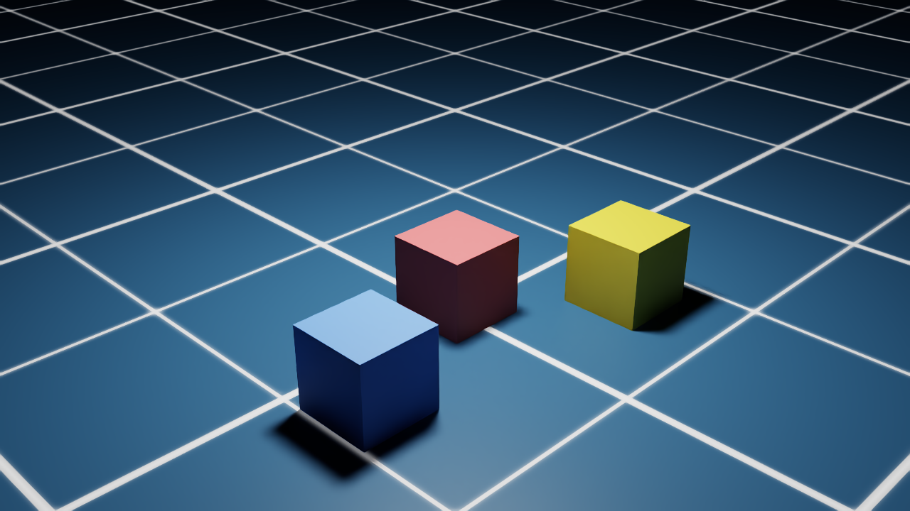

# Isaac Sim Study

Hands-on exploration of [NVIDIA Isaac Sim](https://developer.nvidia.com/isaac/sim) —
physics simulation and synthetic data generation, run headless on modest laptop hardware.

Follows the same learning-in-public approach as my
[deep-learning-study](https://github.com/Hakhyun-Kim/deep-learning-study) repo:
every experiment is scripted, reproducible, and documented — including the failures.

## Why

My background is real-time 3D and simulation: physics middleware support at Havok,
an Unreal Engine 4 / CARLA sensor-validation simulator for autonomous driving at 42dot,
and GPU pipeline optimization for human-eye-resolution VR at Varjo.
Isaac Sim is where that world meets modern Physical AI — this repo documents my first steps.

## Hardware (yes, below min spec)

| | |
|---|---|
| GPU | NVIDIA GeForce RTX 3050 Ti Laptop, **4 GB VRAM** (min spec is 8 GB) |
| Driver | 591.55, CUDA 13.1 |
| OS | Windows 11 Pro |
| Python | 3.11 venv (via `uv`), Isaac Sim 5.1.0 pip install |

Part of the experiment is finding out what a below-min-spec GPU can and cannot do
with headless Isaac Sim.

## Setup

```powershell
uv venv --python 3.11 .venv
.venv\Scripts\activate
pip install --upgrade pip
pip install "isaacsim[all,extscache]==5.1.0" --extra-index-url https://pypi.nvidia.com
```

Running any script requires accepting the NVIDIA Omniverse EULA
(`OMNI_KIT_ACCEPT_EULA=YES`, set inside the scripts).

## Experiments

| # | Script | What it does | Status |
|---|---|---|---|
| 01 | `scripts/01_hello_physics.py` | Headless physics: cube drops onto ground plane, position logged per step | ✅ cube settles at exactly z = 0.250 m |
| 02 | `scripts/02_synthetic_camera.py` | Synthetic data: render the scene to an RGB PNG via Replicator | ✅ 1280×720 RTX render, see below |



## Notes & findings (2026-07-11)

**Both experiments ran successfully, headless, on the 4 GB RTX 3050 Ti** — below
min spec is workable for small scenes, at least without a viewport.

- **Startup cost:** ~60 s of Kit extension loading + ~6 s app startup per run.
  The first ~20 physics steps took ~2 minutes (lazy asset/physics init — the
  default ground plane is fetched from Omniverse cloud assets on first use);
  the remaining 160 steps then finished in ~2 s (~70 steps/s).
- **Physics is exact:** a 0.5 m cube dropped from 2 m comes to rest at
  z = 0.250 m — precisely half the cube size — within ~80 steps.
- **Replicator RGB capture** (camera → render_product → `rgb` annotator) worked
  as scripted on the first try; full run including RTX shader warmup was ~2.5 min.
- **Gotcha — where did my `print()` go?** Kit captures Python stdout into its own
  log rather than the console/redirect. Look in
  `.venv/Lib/site-packages/isaacsim/kit/logs/Kit/Isaac-Sim Python/5.1/kit_*.log`
  for lines tagged `[py stdout]`.
- **Deprecation warnings** show the 5.x namespace migration in progress:
  `omni.replicator.isaac` → `isaacsim.replicator.*`,
  `omni.isaac.version` → `isaacsim.core.version`. New code should use the
  `isaacsim.*` namespaces (as these scripts do for core APIs).

## Study notes

- [notes/01_physics_engines.md](notes/01_physics_engines.md) — Havok vs PhysX vs CARLA/Unreal
  vs Isaac Sim: what's actually different, from someone who shipped with all of them.
  Includes a question bank driving the next experiments.

### Next steps

- Drive an articulated robot (e.g., a wheeled base or simple arm) headless
- Multi-annotator synthetic data: depth + semantic segmentation alongside RGB
- Try domain randomization via `isaacsim.replicator.domain_randomization`
