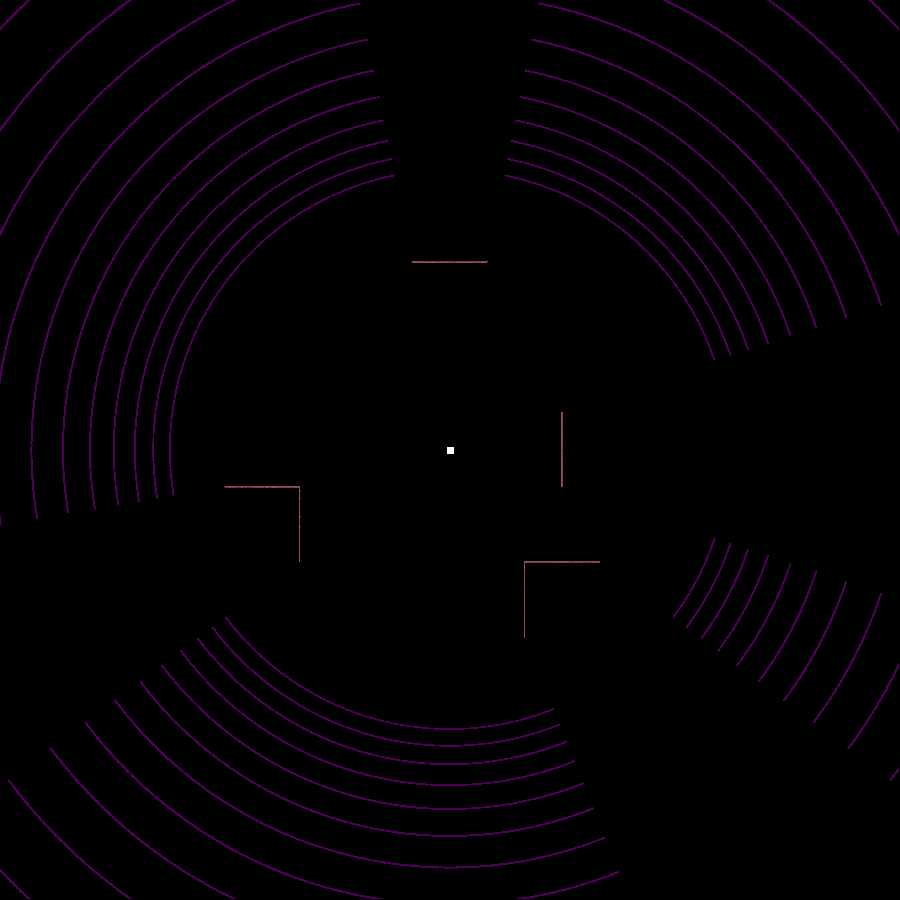
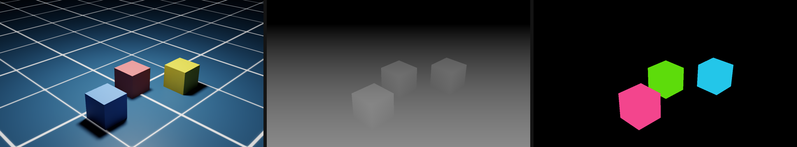
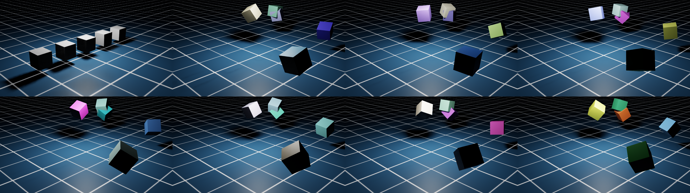

# Isaac Sim Study

Hands-on exploration of [NVIDIA Isaac Sim](https://developer.nvidia.com/isaac/sim) —
physics simulation and synthetic data generation, run headless on modest laptop hardware.

Follows the same learning-in-public approach as my
[deep-learning-study](https://github.com/Hakhyun-Kim/deep-learning-study) repo:
every experiment is scripted, reproducible, and documented — including the failures.

## Why

My background is real-time 3D and simulation: physics middleware support at Havok,
an Unreal Engine 4 / CARLA sensor-validation simulator for autonomous driving at 42dot,
and GPU pipeline optimization for human-eye-resolution VR at Varjo.
Isaac Sim is where that world meets modern Physical AI — this repo documents my first steps.

## Hardware (yes, below min spec)

| | |
|---|---|
| GPU | NVIDIA GeForce RTX 3050 Ti Laptop, **4 GB VRAM** (min spec is 8 GB) |
| Driver | 591.55, CUDA 13.1 |
| OS | Windows 11 Pro |
| Python | 3.11 venv (via `uv`), Isaac Sim 5.1.0 pip install |

Part of the experiment is finding out what a below-min-spec GPU can and cannot do
with headless Isaac Sim.

## Setup

```powershell
uv venv --python 3.11 .venv
.venv\Scripts\activate
pip install --upgrade pip
pip install "isaacsim[all,extscache]==5.1.0" --extra-index-url https://pypi.nvidia.com
```

Running any script requires accepting the NVIDIA Omniverse EULA
(`OMNI_KIT_ACCEPT_EULA=YES`, set inside the scripts).

## Experiments

| # | Script | What it does | Status |
|---|---|---|---|
| 01 | `scripts/01_hello_physics.py` | Headless physics: cube drops onto ground plane, position logged per step | ✅ cube settles at exactly z = 0.250 m |
| 02 | `scripts/02_synthetic_camera.py` | Synthetic data: render the scene to an RGB PNG via Replicator | ✅ 1280×720 RTX render, see below |
| 03 | `scripts/03_articulation_franka.py` | Articulation: command joint targets on a Franka Panda (9 DOF), headless | ✅ max joint error 1.39 → 0.0044 rad in 80 steps |
| 04 | `scripts/04_multi_annotator.py` | Pixel-aligned RGB + depth + semantic segmentation from one render product | ✅ 3 classes labeled, depth 3.7–10.3 m |
| 05 | `scripts/05_domain_randomization.py` | Replicator randomizer graph: cube pose/rotation/color re-rolled per frame | ✅ 8-frame contact sheet |
| 06 | `scripts/06_lidar_pointcloud.py` | RTX LiDAR (Example_Rotary) scan → point cloud .npy + top-down view | ✅ 11.65 M points over 300 frames (~39 K/frame) |
| 07 | `scripts/07_openusd_simready.py` | OpenUSD authoring: build a sim-ready scene file-first with the pxr API alone (instanceable references, materials, UsdPhysics schemas), validate by traversal, then simulate the file as-is | ✅ 15/15 checks; 1 prototype backing 3 instances; all cubes settle at exactly z = 0.250 m |








## Notes & findings (2026-07-11)

**Both experiments ran successfully, headless, on the 4 GB RTX 3050 Ti** — below
min spec is workable for small scenes, at least without a viewport.

- **Startup cost:** ~60 s of Kit extension loading + ~6 s app startup per run.
  The first ~20 physics steps took ~2 minutes (lazy asset/physics init — the
  default ground plane is fetched from Omniverse cloud assets on first use);
  the remaining 160 steps then finished in ~2 s (~70 steps/s).
- **Physics is exact:** a 0.5 m cube dropped from 2 m comes to rest at
  z = 0.250 m — precisely half the cube size — within ~80 steps.
- **Replicator RGB capture** (camera → render_product → `rgb` annotator) worked
  as scripted on the first try; full run including RTX shader warmup was ~2.5 min.
- **Gotcha — where did my `print()` go?** Kit captures Python stdout into its own
  log rather than the console/redirect. Look in
  `.venv/Lib/site-packages/isaacsim/kit/logs/Kit/Isaac-Sim Python/5.1/kit_*.log`
  for lines tagged `[py stdout]`.
- **Deprecation warnings** show the 5.x namespace migration in progress:
  `omni.replicator.isaac` → `isaacsim.replicator.*`,
  `omni.isaac.version` → `isaacsim.core.version`. New code should use the
  `isaacsim.*` namespaces (as these scripts do for core APIs).

### Findings from experiments 03 & 06 (same day, later)

- **Articulation just works:** Franka Panda (5.1 asset path
  `Robots/FrankaRobotics/FrankaPanda/franka.usd`) tracked joint position targets
  from 1.39 rad max error to **0.0044 rad within 80 steps** — the
  reduced-coordinate articulation behavior discussed in
  [notes/01](notes/01_physics_engines.md), observed live on a 4 GB GPU.
- **RTX LiDAR took four attempts** — each failure taught a 5.1 API reality:
  1. `LidarRtx.get_current_frame()` returns only `rendering_time`/`rendering_frame`
     in 5.1 even after `add_point_cloud_data_to_frame()` — the wrapper's data path
     appears dead; use Replicator annotators directly.
  2. The annotator was renamed: docs/4.x `RtxSensorCpuIsaacCreateRTXLidarScanBuffer`
     → 5.1 `IsaacCreateRTXLidarScanBuffer` (the error message helpfully prints the
     full registry).
  3. The (deprecated) ScanBuffer annotator never accumulated data headless — the
     per-frame `IsaacExtractRTXSensorPointCloudNoAccumulator` works **when polled
     every step**; polling forces the SDG graph to evaluate.
  4. On a Korean-locale Windows console (cp949), printing an em-dash from inside
     Kit raises `UnicodeEncodeError` and can take the whole app down — keep
     script prints ASCII.
- **Result:** ~39 K returns/frame, 11.65 M points over 300 frames; the top-down
  view shows ground rings, cube faces, and physically correct occlusion shadows
  behind each cube. The 140 MB `.npy` stays out of git (`output/` is ignored).
- **Newton sighting:** Warp 1.8.2 logs "`warp.sim` is deprecated … transition to
  the forthcoming Newton library" on every run — the engine transition described
  in [notes/01](notes/01_physics_engines.md) is already visible in the logs.

### Findings from experiments 04 & 05

- **Multi-annotator capture worked first try:** semantics via
  `add_update_semantics()` per prim, then `rgb`, `distance_to_image_plane`, and
  `semantic_segmentation` (with `init_params={"colorize": True}`) attached to one
  render product give pixel-aligned ground truth; the segmentation `info.idToLabels`
  maps mask colors back to classes.
- **Replicator-native scenes have no default lighting.** A scene built purely with
  `rep.create.*` (plane, cubes, dome/distant lights) rendered black headless in 5.1 —
  the lights never took effect in the `rep.new_layer()` flow (not root-caused).
  The working pattern: build the scene with `World` + `DynamicCuboid` (the default
  ground plane brings working lights), then drive randomization through the
  Replicator graph — `rep.get.prims(semantics=...)` inside a registered randomizer
  with `rep.modify.pose` + `rep.randomizer.color`, triggered by `rep.trigger.on_frame`.
- **Warm-up frames:** the first `rep.orchestrator.step()` can return an empty
  annotator buffer — skip empties and over-provision the trigger's `num_frames`.
  (Same lesson as the LiDAR per-frame polling, from the other direction.)
- The contact sheet's first tile still shows the un-randomized spawn row — the
  first trigger lands on the following captured frame. Kept as-is: it makes a
  nice before/after.

### Findings from experiment 07 (2026-07-24)

The OpenUSD experiment inverts the usual flow: instead of building the scene through
Isaac Sim helpers, the **file** is authored first — pure `pxr` API, no editor, no
`isaacsim.*` imports — and Isaac Sim then has to consume it as-is.

- **The file carries all the simulation semantics.** A `.usda` authored with nothing
  but `Usd`/`UsdGeom`/`UsdShade`/`UsdPhysics` (physics scene, static ground collider,
  rigid-body cubes) opens in Isaac Sim and simulates correctly with zero
  Isaac-specific setup: `open_stage(path)` → `World()` → step. `World()` reuses the
  authored physics scene rather than adding its own (verified in a follow-up run:
  the live stage holds exactly one `UsdPhysics.Scene`, at the authored
  `/World/physicsScene` path). All three cubes settle at exactly z = 0.250 m —
  same exactness as experiment 01, but from an externally authored file.
- **Instanceable references + physics compose cleanly:** the cube asset lives in its
  own layer (`07_cube_proto.usda`) with `CollisionAPI` and a bound
  `UsdPreviewSurface` material *inside the prototype*; the scene references it three
  times with `instanceable = true` and applies `RigidBodyAPI` + `MassAPI` on each
  instance root. Validation shows 1 prototype backing 3 instances, and PhysX
  resolves the colliders through instance proxies without complaint.
- **Validation-by-traversal is cheap and catches the right things:** stage metadata
  (defaultPrim, upAxis, metersPerUnit), instancing actually consolidating,
  physics APIs present, and material bindings resolving through instance proxies —
  15 checks, pure USD introspection, before the simulator ever runs. A miniature
  of the SimReady asset-validation idea.
- **Physics writes back to USD here:** `ComputeLocalToWorldTransform` on the pxr
  stage tracked `SingleRigidPrim.get_world_pose()` exactly, every step, headless
  with `render=False` — the dual readback was logged side by side to check this.
- **Fastest experiment yet (~1 min total):** an all-local scene skips the
  Omniverse cloud-asset fetch that made experiment 01's first steps take minutes —
  no `add_default_ground_plane()`, no remote robot USD, no stall.

## Study notes

- [notes/01_physics_engines.md](notes/01_physics_engines.md) — Havok vs PhysX vs CARLA/Unreal
  vs Isaac Sim: what's actually different, from someone who shipped with all of them.
  Includes a question bank driving the next experiments.

### Next steps

- OpenUSD composition beyond references: variants (e.g., cube size/material variants
  on the same prototype) and payloads on a larger scene
- URDF import → drive the resulting articulation headless
- First look at Isaac Lab on this hardware (expectations low at 4 GB)
